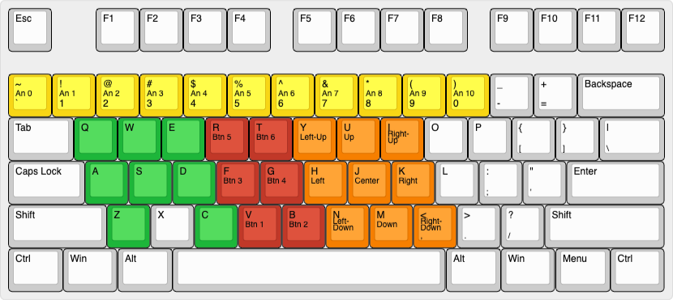
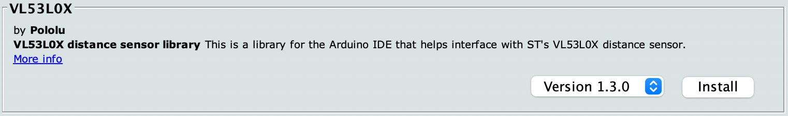
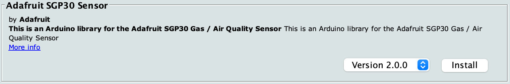
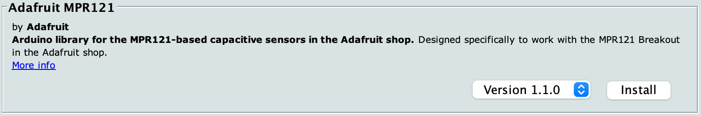

# M5Stack HID Input Framework for xR

This project is a firmware for M5Stack developed by a team of instructors for the participants of [NEWVIEW SCHOOL 2021 TAIPEI](https://newview.design/tc/school/taiwan-2021), a workshop on xR (VR/AR/MR), to enable them to create DIY controllers.

The M5Stack is a toolkit that allows you to easily create various IoT projects by simply connecting sensors and other units with cables. The controller functions as a Bluetooth keyboard, sending keyboard events to the device in response to input from sensors, buttons, etc.

Instead of just accepting a pre-made controller as a constraint and using it as it is, by thinking about what a suitable controller for your work should be and realizing it, you may be able to create a work that expands the concept of VR and AR.

---

該項目是由講師團隊為參加[NEWVIEW SCHOOL 2021 台北](https://newview.design/tc/school/taiwan-2021) xR (VR/AR/MR)研討會的參與者開發的M5Stack固件，使他們能夠創建DIY控制器。

M5Stack是一個工具包，讓您只需用模組連接線連接感測器和其他單元，即可輕鬆創建各種物聯網項目。控制器用作藍牙鍵盤，將鍵盤事件發送到設備以響應來自感測器、按鈕等的輸入。

不再受限於既有的控制器，讓你可以創造不同體驗的控制器去實現你對VR與AR的概念及創意

---

このプロジェクトは、xR（VR/AR/MR）に関するワークショップ「[NEWVIEW SCHOOL 2021 TAIPEI](https://newview.design/tc/school/taiwan-2021)」参加者のために講師チームが開発した、DIYでコントローラを制作できるようにするためのM5Stack用ファームウェアです。

M5Stackは、センサなどのユニットをケーブルで接続するだけで簡単に多彩なIoTプロジェクトを実現できるツールキットです。M5Stackとこのファームウェアを組み合わせることにより、電子工作やプログラミングの経験がない人でも、短時間でDIYコントローラを制作できるでしょう。コントローラはBluetoothキーボードとして機能し、センサやボタンなどの入力に応じたキーボードイベントをデバイスに送信します。

あらかじめ用意されたコントローラを制約条件として受け入れてそのまま用いるのでなく、自分の作品に適したコントローラはどうあるべきかから考えて実現することにより、VRやARの概念を拡張するような作品を制作できるかもしれません。

## Status

### Supported Units

- [Mini Dual Button Unit](https://shop.m5stack.com/collections/m5-unit/products/mini-dual-button-unit)
- [Light Sensor Unit](https://shop.m5stack.com/collections/m5-unit/products/light-sensor-unit)
- [I2C Joystick Unit](https://shop.m5stack.com/collections/m5-unit/products/joystick-unit)
- [Distance Ranging Sensor Unit](https://shop.m5stack.com/products/tof-sensor-unit)
- [TVOC/eCO2 Gas Sensor Unit](https://shop.m5stack.com/products/tvoc-eco2-gas-unit-sgp30)
- [Mini RFID Reader/Writer Unit](https://shop.m5stack.com/products/rfid-sensor-unit)
- [12 Key Capacitive I2C Touch Sensor V3](https://www.seeedstudio.com/Grove-12-Key-Capacitive-I2C-Touch-Sensor-V3-MPR121-p-4694.html) by Seeed Studio

### Supported platforms

- Oculus Quest 2 - [STYLY](https://www.oculus.com/experiences/quest/3982198145147898/) app (from App Lab)
- Windows - [STYLY VR](https://store.steampowered.com/app/693990/STYLYVR_PLATFORM_FOR_ULTRA_EXPERIENCE/) app
- Windows - Chrome
- macOS - Chrome
- iOS/iPadOS - [STYLY](https://itunes.apple.com/jp/app/id1477168256?mt=8) app
- Android - [STYLY](https://play.google.com/store/apps/details?id=com.psychicvrlab.stylymr) app

### Supported combinations (maximum)

The connected Unit(s) input is transmitted on three different channels: analog, joystick, and buttons. The analog and joystick channels can handle up to one sensor Unit input for each at once, and the buttons channel can handle up to six button inputs simultaneously.

| Unit           | Port | Channel  | Pattern A | Pattern B | Pattern C | Pattern D | Pattern E | Pattern F |
|:---------------|:-----|:---------|:----------|:----------|:----------|:----------|:----------|:----------|
| Dual Button    | B    | Buttons  | :bulb:    | :bulb:    | :bulb:    | :bulb:    |           |           |
| Light Sensor   | B    | Analog   |           |           |           |           | :bulb:    | :bulb:    |
| Joystick       | A    | Joystick | :bulb:    | :bulb:    |           |           | :bulb:    | :bulb:    |
| Gas Sensor     | A    | Analog   | :bulb:    | :bulb:    |           |           |           |           |
| Ranging Sensor | A    | Analog   |           |           | :bulb:    | :bulb:    |           |           |
| Touch Sensor   | A    | Buttons  | :bulb:    |           | :bulb:    |           | :bulb:    |           |
| RFID Reader    | A    | Buttons  |           | :bulb:    |           | :bulb:    |           | :bulb:    |

#### Notes

- If you want to connect multiple Units to port A, please connect via a [1 to 3 HUB Expansion Unit](https://shop.m5stack.com/collections/m5-unit/products/mini-hub-module).
- When a Ranging Sensor Unit is connected, you can't use a Joystick Unit nor Gas Sensor Unit.
- To change the connection, double-click the power button on the left side of the M5Stack controller to turn off the power (you cannot turn it off while it is connected to a USB port).

## How to test

1. Choose a pattern from the table above and connect Unit(s) to your M5Stack controller (e.g., M5Stack FIRE)
2. Power on your M5Stack controller
3. If you want to use Dual Button, Light Sensor, or RFID reader, please refer to the "How to setup" section and setup
4. Connect the controller as a Bluetooth device to your device (please follow standard instruction for the device)
5. Open the [Test_Gamepad](https://gallery.styly.cc/scene/9b69aa0b-9ff2-4993-971b-2f8a78c7a347) scene in a browser and bring the browser frontmost
6. Press the `Send` (C) button to start sending
7. Control the joystick, sensor, etc.
8. Once confirmed, press the `Stop` (C) button again to stop sending

### How to setup

#### PORT B

1. Press the `Setup` (A) button to enter the preferences screen
2. Press the `Next` (C) button (if needed) to choose the `PORT B: NONE` line
3. Press the `Go` (B) button
4. Press the `-` (A) or `+` (C) button to be matched to the device connected to the Port B (i.e., `DUAL BUTTON` or `LIGHT`)
5. Press the `Done` (B) button
6. Press the `Exit` (A) button to back to the main screen

#### RFID Tags

1. Press the `Setup` (A) button to enter the preferences screen
2. Press the `Next` (C) button (if needed) to choose the `RFID 1: **:**:**:**` line
3. Press the `Go` (B) button
4. Press the `Reset` (C) button
5. Put an RFID Tag on the RFID Unit, then remove the Tag
6. Press the `Next` (C) button to choose the next line
7. Repeat from step 3 for 3 times to register the remaining 3 RFID Tags
8. Press the `Exit` (A) button to back to the main screen

### Troubleshooting

- "alt. controller" is shown as connected but no input to the STYLY scene. → Please try to unpair the controller in the Bluetooth preference and pair it again.
- Bluetooth connection status on my controller keeps switching between `Connected` and `Disconnected` when not connected. → The controller might have been paired with an old host (i.e., a PC or smartphone). If you no longer use the controller with the host, please remove the device from the host.

## Protocol

- Keys in green: used in STYLY Web Player
- Keys in yellow: used for the Analog channel
- Keys in orange: used for the Joystick channel
- Keys in red: used for the Buttons channel

### Analog channel

| Analog value | Key |
|:-------------|:----|
| 0            | `   |
| 1            | 1   |
| 2            | 2   |
| 3            | 3   |
| 4            | 4   |
| 5            | 5   |
| 6            | 6   |
| 7            | 7   |
| 8            | 8   |
| 9            | 9   |
| 10           | 0   |

### Joystick channel

| Joystick   | Key |
|:-----------|:----|
| Left-Up    | y   |
| Up         | u   |
| Right-Up   | i   |
| Left       | h   |
| Center     | j   |
| Right      | k   |
| Left-Down  | n   |
| Down       | m   |
| Right-Down | ,   |

### Buttons channel

| No. | Name  | Key |
|:----|:------|:----|
| 1   | Fire1 | v   |
| 2   | Fire2 | b   |
| 3   | Fire3 | f   |
| 4   | Jump  | g   |
| 5   |       | r   |
| 6   |       | t   |

## Requirements (for developers)

### Preparing the development environment

- Windows
  - English: [M5Core Quick Start - Arduino Win](https://docs.m5stack.com/en/quick_start/m5core/m5stack_core_get_started_Arduino_Windows)
  - Chinese (simplified): [M5Core 的上手指南 - Arduino Win](https://docs.m5stack.com/zh_CN/quick_start/m5core/m5stack_core_get_started_Arduino_Windows)
- macOS
  - English: [M5Core Quick Start - Arduino Mac](https://docs.m5stack.com/en/quick_start/m5core/m5stack_core_get_started_Arduino_MacOS)
  - Chinese (simplified): [M5Core 的上手指南 - Arduino Mac](https://docs.m5stack.com/zh_CN/quick_start/m5core/m5stack_core_get_started_Arduino_MacOS)

### Libraries

- [M5Stack Library](https://github.com/m5stack/m5stack) by M5Stack
- [ESP32 BLE Keyboard library](https://github.com/T-vK/ESP32-BLE-Keyboard/) by T-vK
- [VL53L0X library for Arduino](https://github.com/pololu/vl53l0x-arduino) by Pololu
- [Adafruit SGP30 Gas / Air Quality I2C sensor](https://github.com/adafruit/Adafruit_SGP30) by Adafruit
- [Adafruit MPR121 Library](https://github.com/adafruit/Adafruit_MPR121) by Adafruit

### How to install

#### The ESP32 BLE Keyboard library

1. Download [the ESP32 BLE Keyboard library](https://github.com/T-vK/ESP32-BLE-Keyboard/releases/download/0.2.3/ESP32-BLE-Keyboard.zip) (don’t have to extract after downloading)
2. In the Arduino IDE, navigate to Sketch → Include Library → Add .ZIP Library...
3. Select the file you just downloaded

#### Other libraries

1. In the Arduino IDE, navigate to Tools → Manage Libraries...
2. Type in a part of each library (i.e., `VL53L0X`, `Adafruit SGP30`, and `Adafruit MPR121`) in the text field in the top right corner, choose the right library and press the install button
3. Repeat the second step for all required libraries

#### Note

- Regarding the VL53L0X library, please install the one by Pololu, not by Adafruit.
- If you want to install the latest stable ESP32 SDK, please put the Stable release link described in [the Arduino core for the ESP32 project's document](https://github.com/espressif/arduino-esp32/blob/master/docs/arduino-ide/boards_manager.md) and install the esp32 board package instead of the M5Stack board package. Please don't confuse this with the M5Stack library; we definitely need the library.

## Credits

- The included MFRC522 I2C Library is from the [RFID_RC522 example](https://github.com/m5stack/M5Stack/tree/master/examples/Unit/RFID_RC522) in the public domain, originally developed by [arozcan](https://github.com/arozcan/MFRC522-I2C-Library) based on the findings of the pioneers and modified by M5Stack.
- To avoid the noise problem regarding the A button on the M5Stack, [the discussion between @mikasa231
san and @lovyan03 san on Twitter](https://twitter.com/mikasa231/status/1403576681701335044) helped us.
- The technique for detecting that an RFIF tag has been removed was implemented by referring to [the example proposed by uluzox](https://github.com/miguelbalboa/rfid/issues/188#issuecomment-495395401) and modified for cooperative multitasking.
